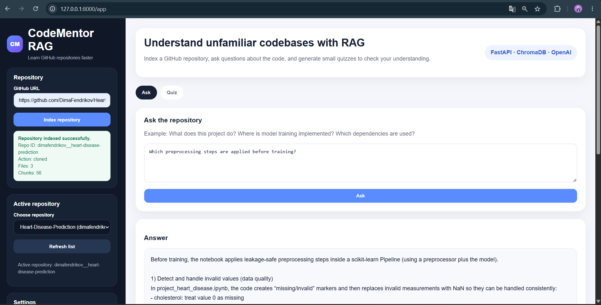
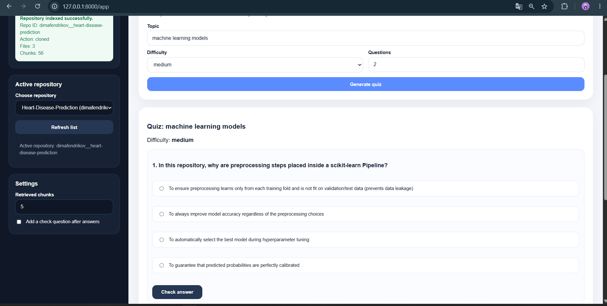

# CodeMentor RAG

CodeMentor RAG is a small FastAPI application that helps users understand GitHub repositories.

The application indexes a public GitHub repository, reads its source files and documentation, splits the content into chunks, creates embeddings, stores them in a local vector database ChromaDB, and uses an LLM to answer questions based on the retrieved repository context.

## Features

- Index public GitHub repositories
- Read code, Markdown, JSON/YAML/TOML, notebooks, and other text-based files
- Clean Jupyter notebooks by keeping only Markdown and code cells
- Chunk Python files by functions and classes when possible
- Store embeddings in ChromaDB
- Use hybrid retrieval: vector search, keyword search, and file-aware search
- Ask questions about the active repository
- Generate quizzes from retrieved repository context
- Check quiz answers in the web interface
- Work with multiple indexed repositories

## Tech stack

- FastAPI
- ChromaDB
- sentence-transformers
- OpenAI API
- GitPython
- HTML, CSS, JavaScript

## How it works

1. The user provides a GitHub repository URL.
2. The backend clones or updates the repository.
3. The file reader loads useful text-based files and skips build folders, virtual environments, binary files, and large files.
4. The chunker splits files into smaller pieces. Python files are split by functions and classes when possible.
5. The embedding model converts chunks into vectors.
6. ChromaDB stores the vectors and chunk metadata.
7. When the user asks a question, the app retrieves relevant chunks.
8. The LLM receives only the retrieved context and writes an answer.

## Setup

Create and activate a virtual environment:

```bash
python -m venv .venv
.venv\Scripts\activate
```

Install dependencies:

```bash
pip install -r requirements.txt
```

Create a `.env` file or set environment variables:

```env
OPENAI_API_KEY=your_api_key_here
OPENAI_MODEL_NAME=gpt-5.4-nano
```

Run the app:

```bash
python -m uvicorn app.main:app --reload
```

Open the web interface:

```text
http://127.0.0.1:8000/app
```
## Screenshots

### Main Interface


### Repository Answer Example



### Quiz Example



## Notes

This is an educational MVP, not a production system. The goal is to demonstrate a clean RAG pipeline, readable backend structure, and a practical interface for repository understanding.
